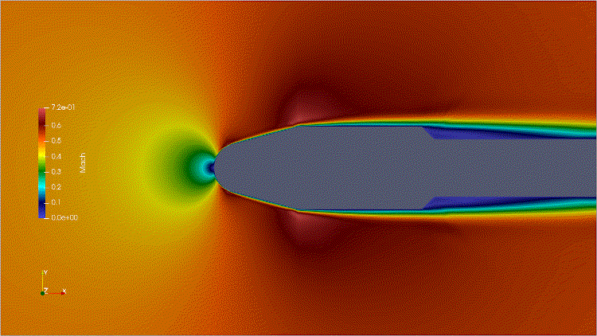
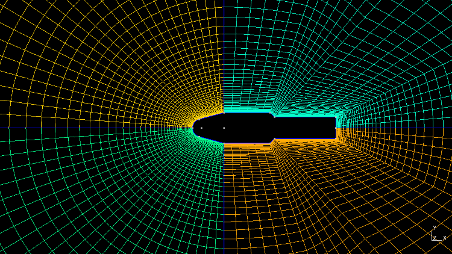
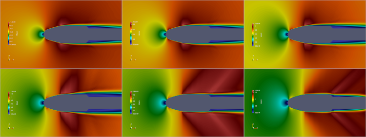
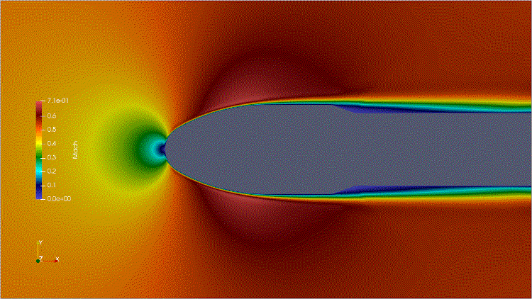
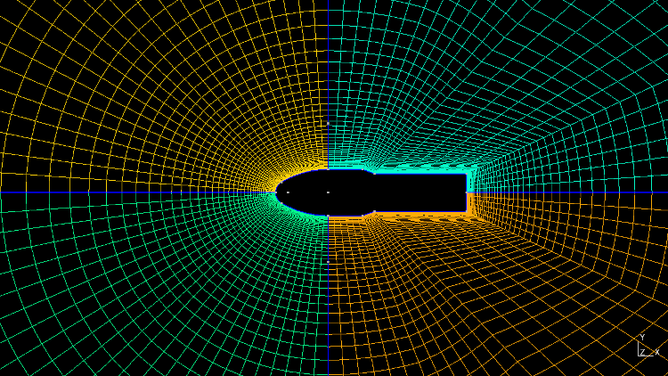
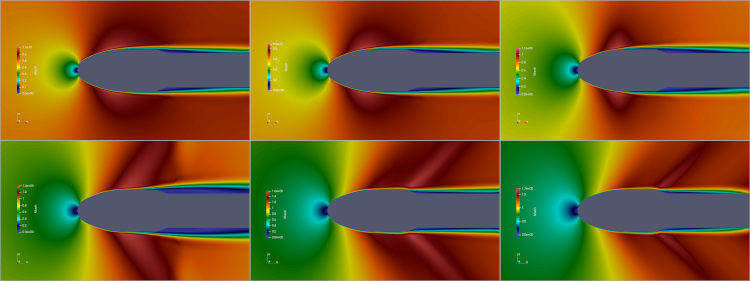

# CFD Flow Simulation of 2D PSLV and GSLV MK-III Fairing (RANS-SST)
> Flow simulation over pslv and gslv-mk3 fairings using SU2 solver using structured mesh with RANS-SST combination.   
   

## Table of contents
* [General info](#general-info)
* [Screenshots](#screenshots)
* [References](#references)
* [Setup](#setup)
* [How to run ](#how)
* [Updates](#updates)
* [To-do list](#to-do)

## General info   
* Gmsh geometry file is written using python wrapper and generates the .su2 file required for the SU2 solver.    
* SU2 configuration is set with RANS (Governing equations - Reynolds-averaged Navier-Stokes) and SST (Turbulence model - Shear Stress Transport).   
* RANS-SST is very sensitive to mesh geometry, size, CFL number, multigrid parameters. Given configuraion (.cfg) and mesh size was tested with mach ranges 0.5 M to 1.0 M at steps of 1.   

## Screenshots
   
Simulated payload fairing 

> PSLV  
1.  Animated result (0.5 M to 1.0 M)    
   
2.  Structured mesh fairing  
   
3.  Mach - 0.5 to 1.0, Angle-of-Attack - 0.0  
      
&nbsp;   
&nbsp;   
> GSLV Mk-III  
1.  Animated result (0.5 M to 1.0 M)    
   
2.  Structured mesh fairing  
   
3.  Mach - 0.5 to 1.0, Angle-of-Attack - 0.0  
     

## Setup
Tested the code on Linux based setup.    
>   
1. Gmsh (Version-4.7.1) with python module - Mesh generation
2. SU2 (Version-7.1.0) - CFD solver 
3. Paraview (Version-5.7.0) - flow visualization  

&nbsp;    
SU2 appears in two flavours. Single core/cpu version or MPI version for parallel computations.    
If you have multi-core processor, then MPI version speeds up the computation. You need to install MCICH   

## How to run   
> Download the files.       
> 
> Generate mesh   
> 
* Verify and install required modules    
* run `python payload_fairing.py`.    

> Single CPU mode:   
> 
* Execute `SU2_CFD turb_SA_gslv_fairing.cfg` on terminal.    
* Open flow.vtu file through Paraview.    

> Parallel computation mode:   
> 
* Execute `mpirun -n 2 SU2_CFD turb_SA_gslv_fairing.cfg` on terminal. (2-cores will be used)   
* Open flow.vtu file through Paraview.  

To execute PSLV, choose the turb_SA_pslv_fairing.cfg file in the command  

## Updates   
* 

## To-do list
* SSLV

